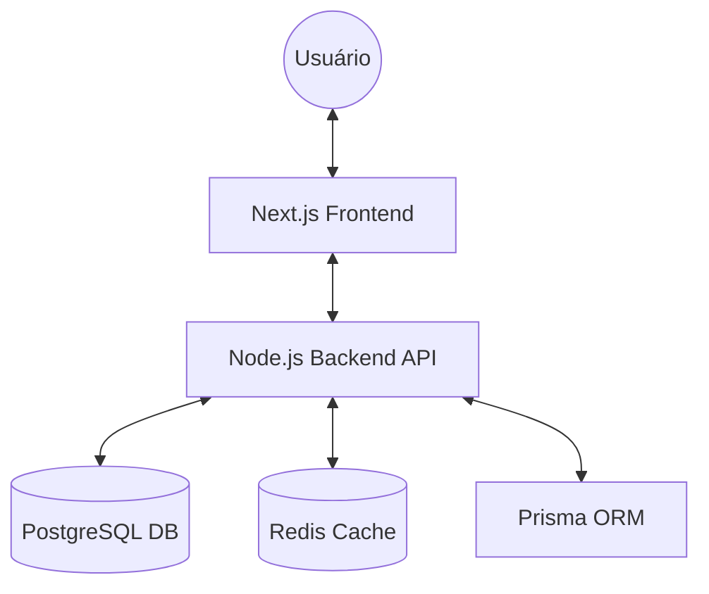

<div align="center">
  
  <h1>🌴 Gestão de Férias - Multi-tenant BMM</h1>
  <p>Uma solução empresarial de alta performance para gerenciamento de ciclos de férias, integrada ao framework BMM.</p>

  []()
  []()
  []()
  []()
</div>

---

## 🔍 Visão Geral

Este projeto é uma plataforma robusta de **Gestão de Férias**, desenvolvida sobre o framework **BMM**. Ele oferece uma arquitetura multi-tenant escalável, permitindo que diferentes empresas ou departamentos gerenciem seus cronogramas de descanso de forma isolada e segura.

## 🏗️ Estratégia "Dual-Stack"

Para garantir máxima eficiência, o projeto utiliza duas configurações de contêineres separadas:

### 1. 🏠 Desenvolvimento Local (`docker-compose.yml`)
Focado em agilidade e depuração.
- **Build:** Compila o código na hora a partir dos fontes.
- **Acesso:** Portas mapeadas diretamente (`localhost:3000`, `localhost:3002`).
- **Uso:** `docker-compose up --build`

### 2. 🚀 Produção / VPS (`docker-stack.yml`)
Focado em segurança, performance e alta disponibilidade.
- **Orquestração:** Docker Swarm (Stacks no Portainer).
- **Proxy:** Integrado ao **Traefik** com SSL automático (Let's Encrypt).
- **Segurança:** Validação rígida de variáveis de ambiente.
- **Uso:** Deploy via Painel do Portainer ou `docker stack deploy`.

---

## ✨ Principais Funcionalidades

- **🗂️ Gestão de Colaboradores:** Cadastro e controle total de vínculos empregatícios.
- **📅 Planejamento de Ciclos:** Algoritmos para cálculo automático de períodos aquisitivos e concessivos.
- **💰 Cálculos Financeiros:** Simulação de bônus, terço de férias e descontos.
- **✍️ Assinaturas Eletrônicas:** Fluxo integrado para formalização de avisos e recibos.
- **🔔 Notificações Inteligentes:** Alertas via e-mail e push sobre prazos críticos.
- **🔌 Integrações Astrais:** Módulo preparado para conexão com sistemas de ERP e RH.

---

## 🏗️ Arquitetura do Sistema



---

## 🚀 Guia de Configuração

### 1. Variáveis de Ambiente
Antes de subir qualquer ambiente, crie seu arquivo `.env`:
```bash
cp .env.example .env
```
Edite as variáveis conforme necessário (veja as instruções dentro do arquivo).

### 2. Deploy em VPS (Portainer)
1. Certifique-se de que a rede `traefik_public` existe no seu Swarm.
2. No Portainer, crie uma nova Stack.
3. Use o conteúdo do arquivo [`docker-stack.yml`](./docker-stack.yml).
4. Configure os domínios (labels Traefik) e as variáveis de ambiente no painel.

---

## 📂 Estrutura do Repositório

```text
├── backend-api/      # Código fonte do Servidor (Node.js)
├── frontend-web/     # Interface WEB (Next.js)
├── docs/             # Documentação e Assets
├── docker-stack.yml  # Configuração para Produção (VPS / Swarm)
├── docker-compose.yml # Configuração para Desenvolvimento Local
└── .env.example      # Guia de configuração de variáveis
```

## 🛡️ Licença

Distribuído sob a licença MIT. Veja `LICENSE` para mais detalhes.

---

<div align="center">
  <p>Desenvolvido com ❤️ pela equipe Fontes Mídias</p>
</div>
