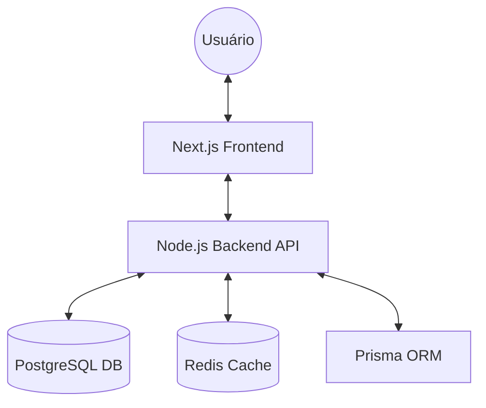

<div align="center">
  
  <h1>🌴 Gestão de Férias - Multi-tenant BMM</h1>
  <p>Uma solução empresarial de alta performance para gerenciamento de ciclos de férias, integrada ao framework BMM.</p>

  []()
  []()
  []()
  []()
</div>

---

## 🔍 Visão Geral

Este projeto é uma plataforma robusta de **Gestão de Férias**, desenvolvida sobre o framework **BMM**. Ele oferece uma arquitetura multi-tenant escalável, permitindo que diferentes empresas ou departamentos gerenciem seus cronogramas de descanso de forma isolada e segura.

Ideal para implantação em **VPS** com **Docker Swarm** e **Portainer**, a solução foca em produtividade, conformidade legal e experiência do colaborador.

## ✨ Principais Funcionalidades

- **🗂️ Gestão de Colaboradores:** Cadastro e controle total de vínculos empregatícios.
- **📅 Planejamento de Ciclos:** Algoritmos para cálculo automático de períodos aquisitivos e concessivos.
- **💰 Cálculos Financeiros:** Simulação de bônus, terço de férias e descontos.
- **✍️ Assinaturas Eletrônicas:** Fluxo integrado para formalização de avisos e recibos.
- **🔔 Notificações Inteligentes:** Alertas via e-mail e push sobre prazos críticos.
- **🔌 Integrações Astrais:** Módulo preparado para conexão com sistemas de ERP e RH.

---

## 🏗️ Arquitetura do Sistema



## 🛠️ Tech Stack

- **Frontend:** Next.js 15, React, Tailwind CSS.
- **Backend:** Node.js, Fastify/Express (BMM Engine).
- **Banco de Dados:** PostgreSQL 15, Prisma ORM.
- **Cache:** Redis 7.
- **Infraestrutura:** Docker, Docker Swarm, Portainer.

---

## 🚀 Guia de Deploy (VPS / Portainer)

### 1. Requisitos Prévios
- VPS com Linux (Ubuntu recomendado).
- Docker e Docker Swarm ativos (`docker swarm init`).
- Portainer instalado e configurado.

### 2. Configuração da Stack
1. No Portainer, vá em **Stacks** > **Add stack**.
2. Nomeie como `gestao-ferias`.
3. Copie o conteúdo do arquivo [`docker-stack.yml`](./docker-stack.yml) para o editor.
4. Adicione as variáveis de ambiente necessárias (veja tabela abaixo).
5. Clique em **Deploy the stack**.

### 3. Variáveis de Ambiente Críticas

| Variável | Descrição | Exemplo |
| :--- | :--- | :--- |
| `DB_USER` | Usuário do Postgres | `admin` |
| `DB_PASSWORD` | Senha do Postgres | `senha_segura` |
| `JWT_SECRET` | Chave secreta para tokens | `seu_segredo_ultra_secreto` |
| `PUBLIC_API_URL` | URL pública da API | `https://api.seudominio.com` |

---

## 📂 Estrutura do Repositório

```text
├── backend-api/      # Código fonte do Servidor (Node.js)
├── frontend-web/     # Interface WEB (Next.js)
├── docs/             # Documentação e Assets
├── docker-stack.yml  # Configuração para Produção (Swarm)
└── docker-compose.yml # Configuração para Desenvolvimento Local
```

## 🛡️ Licença

Distribuído sob a licença MIT. Veja `LICENSE` para mais detalhes.

---

<div align="center">
  <p>Desenvolvido com ❤️ pela equipe Fontes Mídias</p>
</div>
