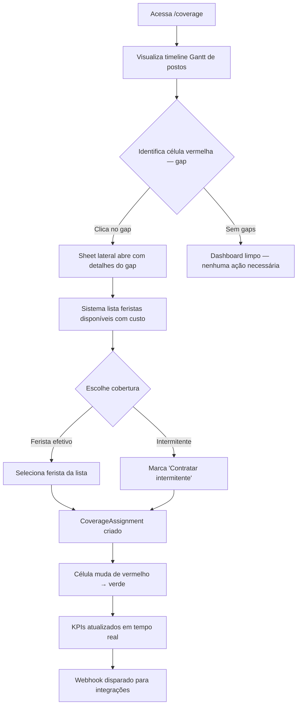
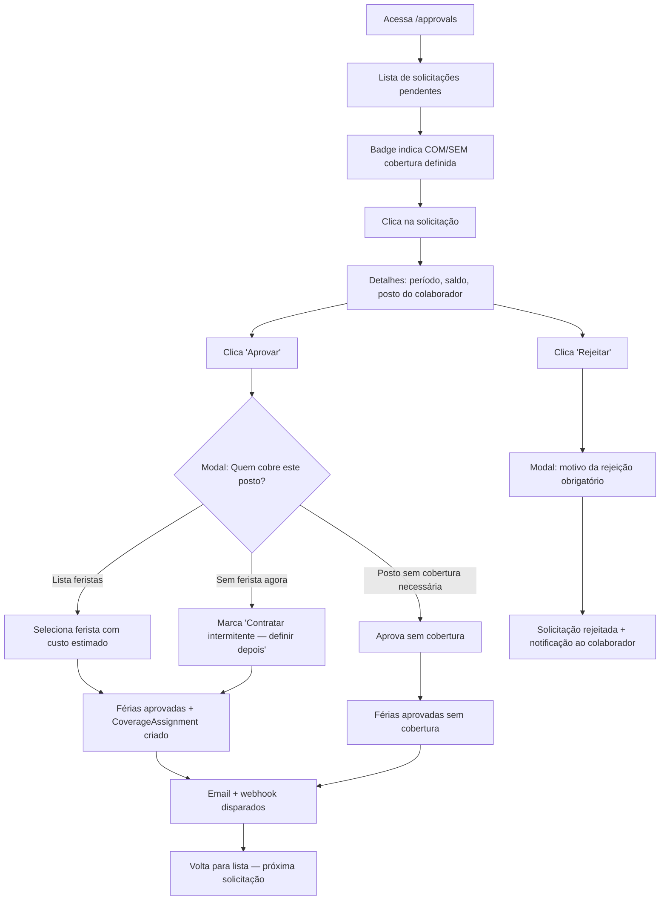
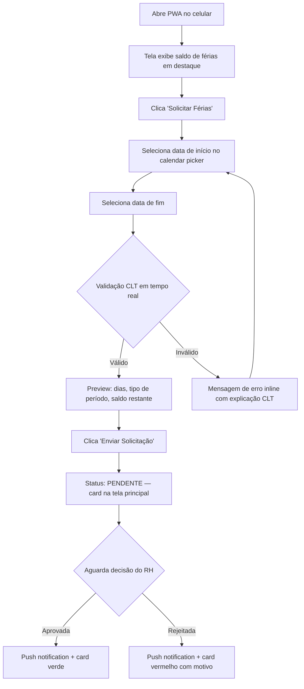
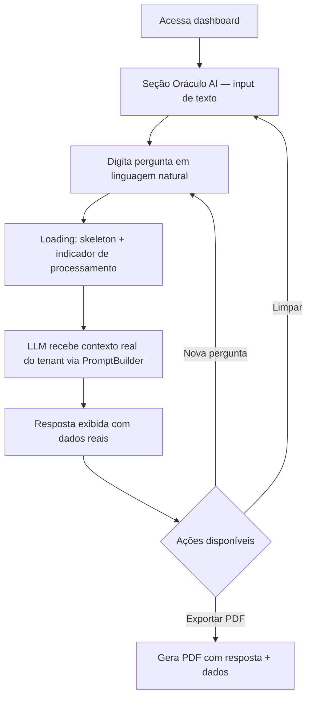
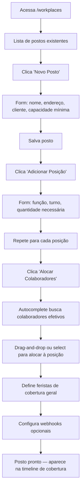
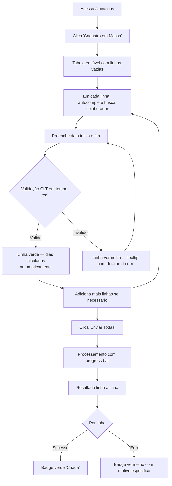

---
stepsCompleted:
  - step-01-init
  - step-02-discovery
  - step-03-core-experience
  - step-04-emotional-response
  - step-05-inspiration
  - step-06-design-system
  - step-07-defining-experience
  - step-08-visual-foundation
  - step-09-design-directions
  - step-10-user-journeys
  - step-11-component-strategy
  - step-12-ux-patterns
  - step-13-responsive-accessibility
  - step-14-complete
status: 'complete'
completedAt: '2026-04-14'
inputDocuments:
  - _evo-output/planning-artifacts/v3-postos-cobertura-ai/prd.md
  - _evo-output/planning-artifacts/v3-postos-cobertura-ai/architecture.md
---

# UX Design Specification gestao-ferias

**Author:** Bruno
**Date:** 2026-04-14

---

## Executive Summary

### Project Vision

GestãoFérias V3 é um SaaS multi-tenant para terceirizadoras que integra gestão de férias CLT com cobertura operacional de postos de trabalho. Substitui planilhas manuais por automação inteligente com motor de cobertura e AI preditiva. O produto serve desde o colaborador que solicita férias pelo celular até a diretoria que consulta projeções de custo via chat com LLM.

### Target Users

| Persona | Perfil | Device Primário | Tech-savviness | Frequência |
|---|---|---|---|---|
| **Gestor de RH** | Operador principal. Cadastra férias em massa, aprova solicitações, planeja cobertura de postos. | Desktop (80%), tablet (20%) | Médio — usa ERPs e planilhas | Diário |
| **Diretoria / Gestor Sênior** | Consulta dashboard AI, faz perguntas estratégicas sobre custos e demanda. | Desktop / mobile | Baixo-médio — quer respostas rápidas | Semanal |
| **Colaborador** | Solicita férias, consulta saldo, assina documentos digitalmente. | Mobile (90%) via PWA | Variável — muitos com pouca fluência digital | Esporádico |
| **Admin do Tenant** | Configura postos, webhooks, integrações, SMTP, chaves LLM. Setup inicial e manutenção. | Desktop | Médio-alto | Eventual |

### Key Design Challenges

1. **Complexidade do Gantt de cobertura** — Visualizar postos × tempo × gaps × coberturas sobrepostas é denso. Precisa ser legível sem treinamento, com cores claras e interação intuitiva.
2. **Bulk create de férias** — Tabela editável multi-linha com validação CLT inline. Risco de confusão se não houver feedback visual claro (verde/vermelho por linha, mensagem de erro específica).
3. **Modal de cobertura no approve** — Aprovar férias + escolher substituto em uma única ação. Precisa ser fluido sem sobrecarregar o gestor com informação excessiva.
4. **PWA mobile para colaborador** — Público com baixa fluência digital em telas ≥320px com área de toque 44px. Precisa ser extremamente simples e direto.
5. **Chat AI** — Interface de linguagem natural precisa transmitir confiança nos dados (fundamentar resposta com fontes reais) sem parecer chatbot genérico.

### Design Opportunities

1. **Dashboard com ação direta** — Gaps vermelhos clicáveis que levam direto à resolução (escolher ferista/intermitente). Zero cliques desperdiçados entre identificar problema e resolver.
2. **Validação CLT em tempo real** — Feedback instantâneo antes de submeter (não apenas no erro). Diferencial claro vs. planilhas onde erros só aparecem depois.
3. **AI contextualizada** — Respostas com dados reais do banco (não genéricas). Exibir a fonte dos dados na resposta (ex: "baseado em 12 férias agendadas e 3 postos com gap") gera confiança e transparência.

## Core User Experience

### Defining Experience

A ação que define o produto é o gestor de RH **aprovar férias e resolver cobertura em uma única ação**. Todo o sistema converge para este momento: cadastro de postos, alocação de funcionários, bulk create de férias — tudo alimenta a decisão de aprovação com cobertura integrada. O loop principal é: identificar gap → escolher substituto → aprovar → posto coberto.

### Platform Strategy

| Contexto | Plataforma | Input Primário | Prioridade |
|---|---|---|---|
| RH / Admin | Web desktop (Next.js PWA) | Mouse + teclado | Principal |
| Colaborador | PWA mobile (≥320px) | Touch (44px min) | Mobile-first |
| Diretoria | Web desktop + mobile | Misto | Responsivo |
| Offline | PWA: cache de saldo e histórico | Read-only | Complementar |

- Web desktop: foco em produtividade, atalhos de teclado, tabelas densas
- PWA mobile: foco em simplicidade, telas únicas, ações diretas
- Ambos: mesma API, mesma autenticação, experiências otimizadas por contexto

### Effortless Interactions

| Interação | Meta de Esforço | Como Atingir |
|---|---|---|
| **Aprovar férias com cobertura** | Máximo 3 cliques | 1 clique abre modal → vê sugestão de substituto → 1 clique confirma |
| **Identificar gaps** | Zero navegação | Gantt com vermelho visível. Clicar no gap → sugestão aparece inline |
| **Cadastro em massa** | Workflow de teclado | Nome → autocomplete → Tab → datas → Enter → próxima linha. Sem mouse obrigatório |
| **Colaborador solicita férias** | Tela única | Abrir PWA → ver saldo → preencher datas → submeter. Sem scroll, sem navegação |
| **Perguntar ao AI** | Digitar e receber | Campo de texto → Enter → resposta com dados reais. Sem configuração prévia |

### Critical Success Moments

| Momento | O usuário pensa... | Se falhar... |
|---|---|---|
| Primeiro gap resolvido via Gantt | "Isso antes levava 1 hora na planilha" | Abandono se interface for confusa |
| Bulk create de 30 férias | "5 minutos em vez de 1 hora no Excel" | Frustração se validação CLT for obscura |
| AI responde com dados reais | "Os números batem com o que conheço" | Desconfiança permanente no módulo |
| Colaborador vê saldo correto | "Posso confiar nisso" | Help desk sobrecarregado com dúvidas |
| Admin configura tenant completo | "Setup em 10 minutos, não 2 dias" | Churn na adoção inicial |

### Experience Principles

1. **Ação direta** — Todo elemento visual que mostra um problema (gap vermelho, vencimento amarelo, pendência) é clicável e leva diretamente à resolução. Zero cliques intermediários.
2. **Validação preventiva** — Mostrar erro antes de submeter, não depois. CLT validada em tempo real no formulário. Feedback visual imediato (verde = ok, vermelho = erro com motivo).
3. **Mobile = essencial, não adaptado** — PWA do colaborador é desenhada mobile-first com telas dedicadas, não "desktop responsivo encolhido".
4. **Confiança por transparência** — AI mostra fonte dos dados. Dashboard mostra cálculos detalhados. Custos com breakdown. Nada é "caixa preta".

## Desired Emotional Response

### Primary Emotional Goals

| Persona | Emoção Principal | O que provoca |
|---|---|---|
| Gestor de RH | **Controle e eficiência** | "Tenho visão completa, resolvo rápido" |
| Diretoria | **Confiança informada** | "Os dados estão aí, posso decidir" |
| Colaborador | **Tranquilidade** | "Meu saldo está certo, meu pedido foi recebido" |
| Admin | **Autonomia** | "Configurei tudo sozinho, sem suporte" |

### Emotional Journey Mapping

**Gestor de RH (persona principal):**

| Etapa | Emoção Desejada | Emoção a Evitar |
|---|---|---|
| Abre o dashboard | Clareza — "sei exatamente o que precisa de atenção" | Sobrecarga — "muita informação, não sei por onde começar" |
| Vê gap vermelho no Gantt | Urgência controlada — "preciso resolver, mas sei como" | Pânico — "não sei o que fazer com isso" |
| Escolhe substituto no modal | Segurança — "a sugestão faz sentido, custo claro" | Dúvida — "será que esse é o melhor?" |
| Bulk create de férias | Produtividade — "fiz em 5 min o que levava 1 hora" | Frustração — "por que essa linha deu erro?" |
| AI responde com dados | Surpresa positiva — "isso é útil de verdade" | Ceticismo — "de onde saiu esse número?" |

**Colaborador (PWA):**

| Etapa | Emoção Desejada | Emoção a Evitar |
|---|---|---|
| Abre PWA | Tranquilidade — "meu saldo está ali, claro" | Confusão — "o que significam esses números?" |
| Preenche datas | Confiança — "validação me diz se está certo" | Ansiedade — "será que vai dar erro depois?" |
| Recebe notificação | Alívio — "aprovaram, está resolvido" | Incerteza — "ninguém me disse nada" |

### Micro-Emotions

| Par Emocional | Meta | Como Garantir |
|---|---|---|
| Confiança > Ceticismo | Dados sempre com fonte visível | Cálculos mostram breakdown, AI cita "baseado em N férias, M postos" |
| Realização > Frustração | Validação CLT preventiva | Erros explicam o porquê E como corrigir |
| Controle > Confusão | Estado atual sempre visível | Sidebar clara, breadcrumbs, KPIs no topo |
| Calma > Ansiedade | Linguagem simples na PWA | Status do pedido sempre visível com cores |
| Autonomia > Dependência | Admin configura sem suporte | Formulários com tooltips explicativos |

### Design Implications

| Emoção Desejada | Decisão de UX |
|---|---|
| Controle | KPIs no topo de cada página. Números concretos, não gráficos abstratos. |
| Confiança | AI mostra "Baseado em: 12 férias, 3 postos, período jul-set". Tooltip com fonte em dados calculados. |
| Produtividade | Bulk create com atalhos de teclado (Tab, Enter). Feedback inline por linha. |
| Tranquilidade | PWA mostra saldo em destaque grande, status com cores simples (verde/amarelo/vermelho). |
| Urgência controlada | Badge vermelho com número (ex: "3 gaps") — não pisca, não grita, mas é impossível ignorar. |
| Segurança na decisão | Modal de cobertura mostra custo estimado e disponibilidade do substituto antes de confirmar. |

### Emotional Design Principles

1. **Informar, não alarmar** — Problemas (gaps, vencimentos) são comunicados com cores e números claros, nunca com animações intrusivas ou linguagem alarmista.
2. **Explicar, não só rejeitar** — Todo erro mostra: o que deu errado + por que (regra CLT) + como corrigir. Nunca apenas "Erro 422".
3. **Confirmar, não deixar no vácuo** — Toda ação do usuário recebe feedback visual imediato (toast, cor da linha, badge atualizado). Nunca "clicou e nada aconteceu".
4. **Simplificar, não esconder** — PWA mobile reduz campos e opções ao essencial. Informação completa está disponível via "Ver mais", não imposta na tela.

## UX Pattern Analysis & Inspiration

### Inspiring Products Analysis

**1. Monday.com — Referência para Gestor de RH (dashboard + gestão visual)**

- Timeline/Gantt colorido e intuitivo — clicável, arrasta e solta
- Status com cores (verde/amarelo/vermelho) legíveis sem legenda
- KPIs no topo de cada board — números grandes, contexto imediato
- Filtros rápidos por pessoa, data, status sem sair da view
- **Relevância:** Gantt de cobertura e dashboard de férias devem seguir essa clareza visual

**2. Nubank — Referência para Colaborador (PWA mobile)**

- Saldo em destaque grande (primeiro elemento da tela)
- Linguagem simples, sem jargão financeiro
- Ações com 1-2 toques (Pix, extrato)
- Feedback imediato (animação sutil confirma ação)
- Funciona em celulares antigos / conexão lenta
- **Relevância:** PWA do colaborador com mesma simplicidade — saldo de férias = "saldo no Nubank"

**3. ChatGPT — Referência para interface AI (chat com dados)**

- Campo de texto limpo, sem formulário complexo
- Resposta com formatação (listas, negrito, tabelas)
- Streaming (resposta aparece gradualmente)
- Sugestões de perguntas para quem não sabe o que perguntar
- **Relevância:** AI Oráculo com campo simples + sugestões pré-definidas + streaming

### Transferable UX Patterns

| Padrão | Origem | Aplicação no GestãoFérias |
|---|---|---|
| Color-coded status sem legenda | Monday | Gantt: verde/vermelho/amarelo. Listas: badges coloridos |
| KPIs no topo da página | Monday | Toda página principal com 3-4 números chave |
| Saldo em destaque | Nubank | PWA: número grande centralizado "X dias disponíveis" |
| Ação primária óbvia | Nubank | Botão principal sempre visível, nunca em menu |
| Sugestões de prompt | ChatGPT | AI Oráculo: chips clicáveis com perguntas frequentes |
| Streaming de resposta | ChatGPT | Resposta LLM aparece gradualmente |
| Tabela editável inline | Google Sheets | Bulk create: editar na célula, Tab navega, Enter confirma |
| Toast de confirmação | Slack | Toda ação (aprovar, criar, salvar) mostra toast breve |

### Anti-Patterns to Avoid

| Anti-Pattern | Por que evitar | Alternativa |
|---|---|---|
| Dashboards com 10+ gráficos | RH quer números, não pizza charts | KPIs numéricos + 1 Gantt |
| Formulários longos com scroll | Colaborador desiste no celular | Tela única, campos mínimos |
| Modais dentro de modais | Confunde navegação, perde contexto | Máximo 1 nível de modal |
| Mensagem de erro genérica | "Erro ao processar" não ajuda | Mensagem específica com regra CLT e como corrigir |
| Loading sem feedback | Usuário clica de novo, duplica | Skeleton loading, spinner no botão, disable após clique |
| Chat AI sem contexto visível | "De onde saiu esse número?" | Seção "Fontes" abaixo da resposta |

### Design Inspiration Strategy

**Adotar diretamente:**
- Color-coded status (Monday) — em todas as listas e Gantt
- Saldo em destaque (Nubank) — PWA do colaborador
- Prompt suggestions (ChatGPT) — AI Oráculo
- Toast confirmations (Slack) — toda ação de mutação

**Adaptar:**
- Gantt do Monday → simplificar para eixo fixo (postos × dias), sem drag-and-drop
- Streaming do ChatGPT → apenas no `/predict/ask`, não em toda a API
- Inline editing do Google Sheets → apenas no bulk create, não em listagens gerais

**Evitar:**
- Complexidade visual de ERPs tradicionais (Senior, TOTVS) — público não é power user de ERP
- Gamificação artificial (badges, pontos) — não faz sentido para RH operacional
- Dark patterns de urgência (countdown timers) — conflita com "informar, não alarmar"

## Design System Foundation

### Design System Choice

**shadcn/ui** — componentes copiáveis baseados em Radix UI + Tailwind CSS.

Não é uma dependência npm — componentes são copiados para `frontend-web/src/components/ui/` e customizados livremente. Built on Radix primitives para acessibilidade WCAG.

### Rationale for Selection

1. **Compatível com stack existente** — Tailwind CSS já instalado, zero conflito
2. **Componentes que o projeto precisa já existem** — Dialog, Table, Toast, Form, Tabs, Badge, Chart
3. **Não cria dependência** — código vive no projeto, controle total
4. **Acessível por padrão** — Radix primitives garantem WCAG compliance
5. **AI-friendly** — agentes AI geram código shadcn/ui com alta qualidade

### Implementation Approach

**Componentes shadcn/ui a instalar:**

| Componente | Uso no GestãoFérias |
|---|---|
| `Dialog` | Modal de cobertura no approve, modal de posto, confirmações |
| `Table` | Listagens de férias, colaboradores, postos, audit logs |
| `Form` + `Input` + `Label` | Cadastro de postos, configurações, setup tenant |
| `Select` + `Combobox` | Autocomplete de colaborador no bulk create, filtros |
| `Toast` | Confirmação de ações (aprovação, criação, erro) |
| `Badge` | Status de férias, gaps, tipos de colaborador |
| `Tabs` | Navegação dentro de páginas (ex: settings) |
| `Card` | KPIs no dashboard, cards de resumo |
| `Button` | Ações primárias/secundárias/destrutivas |
| `Skeleton` | Loading states em tabelas e cards |
| `Tooltip` | Info contextual (regras CLT, cálculos, fontes AI) |
| `Sheet` | Sidebar mobile, painéis laterais |
| `Calendar` + `DatePicker` | Seleção de datas em férias e coberturas |

**Componentes custom (não shadcn):**

| Componente | Tecnologia | Motivo |
|---|---|---|
| `CoverageGantt` | frappe-gantt + wrapper React | Gantt especializado, sem equivalente em shadcn |
| `BulkVacationTable` | TanStack Table + shadcn inputs | Tabela editável multi-linha, lógica complexa |
| `AIChat` | Custom + shadcn primitives | Interface de chat com streaming, sem equivalente |

### Customization Strategy

**Design Tokens (CSS variables via Tailwind):**

```css
/* Status colors — usados em badges, Gantt, indicadores */
--color-gap: #EF4444;        /* vermelho — posto descoberto */
--color-covered: #22C55E;    /* verde — posto coberto */
--color-planned: #EAB308;    /* amarelo — cobertura planejada */
--color-pending: #3B82F6;    /* azul — aguardando aprovação */
--color-expired: #F97316;    /* laranja — férias vencendo (risco dobra) */

/* Superfícies */
--color-background: #FFFFFF;
--color-surface: #F8FAFC;
--color-border: #E2E8F0;

/* Texto */
--color-text-primary: #0F172A;
--color-text-secondary: #64748B;
--color-text-muted: #94A3B8;
```

**Tipografia:**

| Elemento | Tamanho | Peso | Uso |
|---|---|---|---|
| KPI número | 2rem (32px) | Bold | Dashboard, saldo PWA |
| Heading página | 1.5rem (24px) | Semibold | Título de cada page |
| Heading seção | 1.125rem (18px) | Semibold | Subtítulos, nomes de cards |
| Body | 0.875rem (14px) | Regular | Texto geral, tabelas |
| Caption | 0.75rem (12px) | Regular | Labels, timestamps, tooltips |

**Spacing e Layout:**

- Grid: 8px base unit (Tailwind: `gap-2` = 8px, `gap-4` = 16px)
- Sidebar: 256px fixo desktop, sheet overlay mobile
- Content area: max-width 1280px centralizado
- Cards/KPIs: grid responsivo `grid-cols-2 md:grid-cols-4`
- Touch targets: mínimo 44×44px (NFR-ACC-001)

## Core User Experience (Detailed)

### Defining Experience

> **"Vejo o gap, clico, resolvo."** — Identificar posto descoberto → escolher substituto → posto coberto. Em 3 cliques.

Essa é a interação que define o GestãoFérias. Tudo no sistema (cadastro de postos, alocações, bulk create de férias, AI preditiva) alimenta esse momento de decisão. Se essa interação funcionar perfeitamente, o produto se vende sozinho.

### User Mental Model

| Como faz hoje (planilha/memória) | O que espera do sistema |
|---|---|
| Planilha Excel com nomes e datas | Visualização temporal tipo calendário/Gantt |
| Liga para colegas perguntando "quem está disponível?" | Sistema sugere automaticamente quem pode cobrir |
| Calcula custo no papel/calculadora | Custo aparece junto da sugestão |
| Manda WhatsApp para o colaborador | Notificação automática após aprovação |
| Não sabe se tem posto descoberto até alguém reclamar | Dashboard mostra gaps antes que virem problema |

**Frustrações atuais:** esquecimento, retrabalho, falta de visibilidade, cálculos errados, decisão baseada em "achismo".

**Modelo mental:** O gestor pensa em termos de "posto X precisa de alguém de tal data a tal data". O sistema deve espelhar exatamente esse modelo — posto, período, pessoa.

### Success Criteria

| Critério | Métrica |
|---|---|
| Resolver gap em ≤ 3 cliques | Clique no gap → modal → confirmar |
| Tempo de decisão < 30 segundos | Sugestão com custo aparece instantaneamente |
| Zero gaps esquecidos | Dashboard mostra count de gaps pendentes |
| Confiança na sugestão | Custo e disponibilidade visíveis antes de confirmar |
| Feedback imediato | Toast + Gantt atualiza cor de vermelho para verde |

### Novel UX Patterns

Nenhuma interação é verdadeiramente novel — todas são padrões conhecidos combinados de forma nova no domínio de RH/cobertura:

| Padrão | Origem | Aplicação no GestãoFérias |
|---|---|---|
| Gantt timeline colorido | Monday, MS Project | Eixo X=dias, Y=postos, células coloridas |
| Click-to-action em célula | Google Sheets | Clicar no gap vermelho abre modal de resolução |
| Suggestion list com custo | E-commerce (comparação) | Lista de feristas com custo, disponibilidade, conflitos |
| Inline confirmation | Slack (reações) | Confirmar substituto no modal, sem página nova |
| Real-time update | Trello (drag) | Gantt atualiza cor ao vivo após confirmação |

A inovação não está no padrão individual, mas na combinação: **Gantt + click-to-resolve + sugestão automática + update em tempo real** — isso não existe em nenhum produto de RH hoje.

### Experience Mechanics

**Fluxo "Click the gap, pick the cover":**

**1. Initiation:**
- Gestor abre `/coverage` → Gantt carrega com postos no eixo Y
- Células VERMELHAS saltam aos olhos (gaps detectados)
- Badge no topo: "3 gaps pendentes"

**2. Interaction:**
- Clica na célula vermelha
- Modal abre: "Posto X — Gap de 01/07 a 30/07 (30 dias)"
- Lista de feristas disponíveis com custo e conflitos:
  - Ana Santos | FERISTA | R$ 0 | Sem conflitos
  - Roberto Dias | FERISTA | R$ 0 | Posto Y até 28/06
  - [+ Contratar intermitente] | INTERMITENTE | R$ 3.200
- Gestor seleciona "Ana Santos"

**3. Feedback:**
- Botão "Confirmar Cobertura" ativa
- Preview: "Ana Santos cobrirá Posto X de 01/07 a 30/07"
- Clica confirmar

**4. Completion:**
- Toast: "✓ Cobertura criada — Ana Santos → Posto X"
- Célula no Gantt muda de VERMELHO para VERDE ao vivo
- Badge atualiza: "2 gaps pendentes"
- WebSocket notifica outros usuários logados
- Webhook disparado para integrações externas

## Visual Design Foundation

### Color System

**Theming Dinâmico por Tenant (FR-UI-010):**

Todas as cores abaixo são **valores padrão**. Cada tenant pode sobrescrever `primary`, `primary-hover` e `primary-light` via configuração no banco (`Tenant.brandPrimaryColor`, `Tenant.brandSecondaryColor`). O frontend aplica CSS custom properties dinamicamente no login com base nos dados do tenant.

```typescript
// Fluxo: Login → API retorna tenant branding → aplica no :root
document.documentElement.style.setProperty('--primary', tenant.brandPrimaryColor || '#2563EB')
document.documentElement.style.setProperty('--primary-hover', darken(tenant.brandPrimaryColor, 10) || '#1D4ED8')
```

**Dados armazenados no model Tenant:**

| Campo | Tipo | Default | Descrição |
|---|---|---|---|
| `brandPrimaryColor` | String? | `#2563EB` | Cor primária (botões, links, sidebar) |
| `brandSecondaryColor` | String? | `null` | Cor secundária (acentos opcionais) |
| `brandLogoUrl` | String? | `null` | URL da logo (upload via `/settings`) |
| `brandName` | String? | `Tenant.name` | Nome exibido na sidebar e PDF |

**Nota:** Cores de status (gap, covered, pending, etc.) NÃO são customizáveis por tenant — são semânticas e devem ser consistentes para não confundir a interpretação visual.

**Paleta Principal (defaults, sobrescrevíveis por tenant):**

| Token | Hex | Uso |
|---|---|---|
| `--primary` | `#2563EB` (Blue 600) | Ações primárias, links, seleção ativa |
| `--primary-hover` | `#1D4ED8` (Blue 700) | Hover em botões primários |
| `--primary-light` | `#EFF6FF` (Blue 50) | Background de seleção, highlight |

**Paleta de Status (core do produto):**

| Token | Hex | Uso | Onde aparece |
|---|---|---|---|
| `--status-gap` | `#EF4444` (Red 500) | Posto descoberto | Gantt célula, badge, KPI |
| `--status-covered` | `#22C55E` (Green 500) | Posto coberto | Gantt célula, badge |
| `--status-planned` | `#EAB308` (Yellow 500) | Cobertura planejada | Gantt célula, badge |
| `--status-pending` | `#3B82F6` (Blue 500) | Aguardando aprovação | Badge férias, lista |
| `--status-expired` | `#F97316` (Orange 500) | Risco de dobra CLT | Alerta, badge, KPI |
| `--status-approved` | `#22C55E` (Green 500) | Férias aprovadas | Badge, timeline |
| `--status-rejected` | `#EF4444` (Red 500) | Férias rejeitadas | Badge |

**Superfícies e Bordas:**

| Token | Hex | Uso |
|---|---|---|
| `--background` | `#FFFFFF` | Fundo principal |
| `--surface` | `#F8FAFC` (Slate 50) | Cards, sidebar, áreas agrupadas |
| `--surface-hover` | `#F1F5F9` (Slate 100) | Hover em linhas de tabela |
| `--border` | `#E2E8F0` (Slate 200) | Bordas de cards, inputs, divisores |
| `--border-focus` | `#2563EB` (Blue 600) | Focus ring em inputs (acessibilidade) |

**Texto:**

| Token | Hex | Uso |
|---|---|---|
| `--text-primary` | `#0F172A` (Slate 900) | Títulos, texto principal |
| `--text-secondary` | `#475569` (Slate 600) | Texto de apoio, labels |
| `--text-muted` | `#94A3B8` (Slate 400) | Placeholders, timestamps |
| `--text-inverse` | `#FFFFFF` | Texto sobre botões primários, badges coloridos |

**Contraste WCAG AA:**
- Texto primário sobre background: 15.4:1 ✅ (mínimo 4.5:1)
- Texto secundário sobre background: 7.1:1 ✅
- Texto muted sobre background: 3.3:1 ⚠️ (usar apenas para info não essencial)
- Branco sobre primary blue: 5.2:1 ✅
- Branco sobre status-gap red: 4.6:1 ✅

### Typography System

**Font Stack:**

```css
--font-sans: 'Inter', system-ui, -apple-system, sans-serif;
--font-mono: 'JetBrains Mono', 'Fira Code', monospace; /* código, CPF formatado */
```

Inter: escolhida por legibilidade em telas, suporte a números tabulares (importante para tabelas financeiras e KPIs), e disponibilidade gratuita via Google Fonts.

**Type Scale (base 14px):**

| Token | Tamanho | Peso | Line Height | Uso |
|---|---|---|---|---|
| `--text-kpi` | 32px (2rem) | 700 Bold | 1.2 | KPI números, saldo PWA |
| `--text-h1` | 24px (1.5rem) | 600 Semibold | 1.3 | Título de página |
| `--text-h2` | 18px (1.125rem) | 600 Semibold | 1.4 | Subtítulos, nomes de cards |
| `--text-h3` | 16px (1rem) | 600 Semibold | 1.4 | Headers de seção, modal title |
| `--text-body` | 14px (0.875rem) | 400 Regular | 1.5 | Texto geral, tabelas, formulários |
| `--text-small` | 13px (0.8125rem) | 400 Regular | 1.5 | Texto secundário em tabelas |
| `--text-caption` | 12px (0.75rem) | 400 Regular | 1.5 | Labels, timestamps, tooltips |
| `--text-badge` | 11px (0.6875rem) | 600 Semibold | 1 | Badges de status |

**Números tabulares:** Inter com `font-variant-numeric: tabular-nums` em todas as tabelas e KPIs para alinhamento vertical perfeito de valores monetários.

### Spacing & Layout Foundation

**Base Unit:** 4px (Tailwind default)

| Token | Valor | Tailwind | Uso |
|---|---|---|---|
| `--space-1` | 4px | `p-1` | Padding interno de badges |
| `--space-2` | 8px | `p-2` / `gap-2` | Espaço entre elementos inline |
| `--space-3` | 12px | `p-3` / `gap-3` | Padding de inputs, cells de tabela |
| `--space-4` | 16px | `p-4` / `gap-4` | Padding de cards, espaço entre seções |
| `--space-6` | 24px | `p-6` / `gap-6` | Padding de modais, margem entre blocos |
| `--space-8` | 32px | `p-8` | Margem de página, espaço entre seções grandes |

**Layout Grid:**

| Breakpoint | Largura | Colunas | Uso |
|---|---|---|---|
| Mobile (≥320px) | 100% | 1 coluna | PWA colaborador |
| Tablet (≥768px) | 100% | 2 colunas | Dashboard compacto |
| Desktop (≥1024px) | max 1280px | Sidebar 256px + conteúdo | Layout principal RH |
| Wide (≥1440px) | max 1440px | Sidebar + conteúdo expandido | Gantt com mais dias visíveis |

**Estrutura de Página (Desktop):**

```
┌─────────────────────────────────────────────────┐
│ Sidebar (256px, fixo)  │  Header (nome da página, breadcrumb)  │
│                        │──────────────────────────────────────│
│  Logo                  │  KPIs (grid 2-4 cols)                │
│  Navigation            │──────────────────────────────────────│
│  · Dashboard           │                                      │
│  · Colaboradores       │  Conteúdo principal                  │
│  · Férias              │  (tabela, Gantt, formulário)         │
│  · Postos              │                                      │
│  · Cobertura           │                                      │
│  · Aprovações          │                                      │
│  · AI Oráculo          │                                      │
│  · Webhooks            │                                      │
│  · Configurações       │                                      │
└─────────────────────────────────────────────────┘
```

**Estrutura de Página (PWA Mobile):**

```
┌──────────────────┐
│  Header (saldo)  │
│  ┌────────────┐  │
│  │  32px      │  │
│  │  X dias    │  │
│  └────────────┘  │
│                  │
│  Ação principal  │
│  [Solicitar]     │
│                  │
│  Histórico       │
│  · Jul 2026 ✅   │
│  · Pendente ⏳   │
│                  │
│  ━━━━━━━━━━━━━━  │
│  Nav bottom bar  │
└──────────────────┘
```

### Accessibility Considerations

| Requisito | Implementação | NFR |
|---|---|---|
| Contraste mínimo 4.5:1 | Todas as cores de texto validadas contra backgrounds | WCAG AA |
| Touch target 44×44px | Botões, links, cells de tabela no mobile | NFR-ACC-001 |
| Focus visible | `--border-focus` ring azul em todos elementos interativos | WCAG 2.1 |
| Tela mínima 320px | Layout single-column no PWA mobile | NFR-ACC-001 |
| Labels em inputs | Todo input com `<label>` associado via `htmlFor` | WCAG AA |
| Aria labels | Badges de cor com `aria-label` descritivo (ex: "status: gap descoberto") | Screen readers |
| Keyboard navigation | Tab order lógico, Enter/Space ativam, Escape fecha modais | WCAG 2.1 |
| Reduced motion | `prefers-reduced-motion` desabilita animações de toast e transições | WCAG 2.1 |

---

## Design Direction Decision

**Direção escolhida:** Compacta (Direction 1)

**Mockup de referência:** `_evo-output/planning-artifacts/v3-postos-cobertura-ai/ux-design-directions.html`

### Parâmetros da Direção Compacta

| Parâmetro | Valor |
|---|---|
| Sidebar width | 220px |
| Row height (tabelas/Gantt) | 28px |
| Card padding | 12px |
| Gap entre cards | 12px |
| Font size base | 13px |
| Font size small | 11px |
| KPI card height | 72px |
| Header height | 48px |
| Border radius | 6px |

### Justificativa

A direção Compacta maximiza a densidade de informação na tela, permitindo que o operador de RH visualize mais postos, colaboradores e períodos simultaneamente na grade Gantt sem necessidade de scroll. Isso é essencial para o fluxo principal de "identificar gap → clicar → atribuir cobertura", onde ver o panorama completo acelera a tomada de decisão. Operadores de RH de terceirizadoras trabalham tipicamente em monitores de 15" a 21", e a direção compacta otimiza o uso desse espaço.

### Tokens de Espaçamento Derivados

```css
--spacing-xs: 4px;
--spacing-sm: 8px;
--spacing-md: 12px;
--spacing-lg: 16px;
--spacing-xl: 24px;
--row-height: 28px;
--sidebar-width: 220px;
--header-height: 48px;
```

---

## User Journey Flows

### Journey 1: RH planeja cobertura de um posto

**Entry point:** Sidebar → Cobertura (`/coverage`)
**Trigger:** Férias aprovadas ou próximas do vencimento



**Pontos de decisão:**
- Escolher entre ferista efetivo (custo menor, já disponível) ou intermitente (custo maior, contratação futura)
- Se múltiplos feristas disponíveis, sistema ordena por custo crescente

**Feedback visual:**
- Célula vermelha → verde imediatamente ao criar cobertura
- Toast de confirmação: "Cobertura atribuída com sucesso"
- KPI cards atualizam contadores em tempo real

**Recuperação de erro:**
- Se ferista já comprometido no período: toast de erro + lista atualizada
- Se período inválido: validação inline na sheet lateral

---

### Journey 2: RH aprova férias com cobertura integrada

**Entry point:** Sidebar → Aprovações (`/approvals`)
**Trigger:** Solicitação de férias pendente na fila



**Pontos de decisão:**
- Aprovar com cobertura, aprovar sem cobertura, ou rejeitar
- Escolher ferista específico ou postergar decisão de cobertura

**Feedback visual:**
- Badge muda de "Pendente" (amarelo) → "Aprovada" (verde) ou "Rejeitada" (vermelho)
- Contador de pendentes decrementa no sidebar
- Toast de confirmação com resumo da ação

---

### Journey 3: Colaborador solicita férias via PWA

**Entry point:** PWA mobile → Tela inicial
**Trigger:** Deseja solicitar período de férias



**Validações CLT inline:**
- Não pode iniciar em quinta ou sexta-feira
- Mínimo 5 dias corridos por período
- Máximo 3 fracionamentos
- Saldo suficiente

**Feedback visual:**
- Calendar picker com dias inválidos desabilitados (cinza)
- Preview mostra cálculo de dias antes de enviar
- Card de status com cor semântica na tela principal

---

### Journey 4: Diretoria consulta AI em linguagem natural

**Entry point:** Dashboard → Seção "Oráculo AI"
**Trigger:** Necessidade de resposta rápida



**Tratamento de erro:**
- Se LLM indisponível: fallback com mensagem amigável + sugestão de consultar relatórios
- Se pergunta fora do escopo: resposta educada redirecionando para perguntas suportadas

---

### Journey 5: Admin configura postos e alocações

**Entry point:** Sidebar → Postos (`/workplaces`)
**Trigger:** Novo cliente ou reorganização



---

### Journey 6: RH cadastra férias em massa via formulário

**Entry point:** Sidebar → Férias (`/vacations`) → "Cadastro em Massa"
**Trigger:** Programação anual ou agendamento múltiplo



**Otimizações:**
- Autocomplete com debounce de 300ms para busca de colaborador
- Tab navega entre campos da linha, Enter pula para próxima linha
- Validação CLT é executada ao sair do campo de data (onBlur)
- Máximo 50 linhas por envio (limite API)

---

### Journey Patterns

**Padrões de navegação:**
- Entry point sempre via sidebar (desktop) ou bottom nav (mobile)
- Ações contextuais aparecem em sheet lateral ou modal, nunca em nova página
- Breadcrumb mostra localização: Posto → Posição → Período

**Padrões de decisão:**
- Decisões binárias (aprovar/rejeitar) usam botões primário/destrutivo lado a lado
- Decisões com múltiplas opções (escolher ferista) usam lista ordenada com recomendação destacada
- Decisões adiáveis ("definir depois") sempre disponíveis para não bloquear o fluxo

**Padrões de feedback:**
- Ações imediatas: toast + atualização visual inline (cor da célula, badge, contador)
- Ações assíncronas: loading skeleton → resultado com estado final
- Erros de validação: inline no campo, vermelho, com texto explicativo
- Erros de sistema: toast vermelho com opção de retry

### Flow Optimization Principles

1. **Minimal clicks to value:** Fluxo principal de cobertura (Journey 1) requer 3 cliques: identificar gap → selecionar ferista → confirmar
2. **Decisão e ação no mesmo contexto:** Aprovação de férias inclui cobertura no mesmo modal, sem navegação extra
3. **Validação preventiva:** CLT é validada em tempo real, impedindo erros antes do envio
4. **Feedback instantâneo:** Cores semânticas mudam imediatamente após a ação, sem refresh
5. **Batch efficiency:** Cadastro em massa permite tab-through para preencher rapidamente sem usar mouse

---

## Component Strategy

### Design System Components (shadcn/ui)

Componentes disponíveis no shadcn/ui que cobrem diretamente as necessidades do projeto:

| Componente shadcn/ui | Uso no GestãoFérias | Jornadas |
|---|---|---|
| **Button** | Ações primárias (Aprovar, Enviar, Criar) e secundárias | Todas |
| **Dialog / Sheet** | Modal de aprovação, sheet lateral de detalhes do gap | J1, J2 |
| **Table** | Listagens de colaboradores, solicitações, postos | J2, J5, J6 |
| **Input / Textarea** | Formulários de cadastro, busca do Oráculo AI | J4, J5, J6 |
| **Select / Combobox** | Seleção de ferista, filtros de período | J1, J2 |
| **Badge** | Status de solicitação, cobertura COM/SEM | J2 |
| **Card** | KPI cards no dashboard | J1, J4 |
| **Toast (Sonner)** | Feedback de ações: sucesso, erro, aviso | Todas |
| **Calendar** | Date picker para seleção de período de férias | J3, J6 |
| **Tabs** | Navegação entre views no dashboard | J4 |
| **Tooltip** | Detalhes de erro CLT, informações adicionais | J3, J6 |
| **Progress** | Barra de progresso no envio em massa | J6 |
| **Skeleton** | Loading states enquanto dados carregam | Todas |
| **Avatar** | Foto/iniciais do colaborador nas listagens | J2, J6 |
| **Dropdown Menu** | Menu de ações contextuais (editar, excluir) | J5 |
| **Command** | Autocomplete de busca de colaborador (cmdk) | J6 |
| **Sidebar** | Navegação lateral principal (220px compacta) | Todas |
| **Separator** | Divisores visuais entre seções | Todas |

### Custom Components

Componentes que **não existem** no shadcn/ui e precisam ser construídos:

#### 1. CoverageGanttGrid

**Propósito:** Visualização de timeline de cobertura de postos com células clicáveis
**Uso:** Tela principal `/coverage` — é o componente central do produto
**Jornadas:** J1

**Anatomia:**
- Header: meses/semanas com scroll horizontal
- Linhas: uma por posto/posição (altura 28px na direção compacta)
- Células: representam dias/semanas, coloridas por status
- Eixo Y: nomes dos postos com collapse por grupo

**Estados das células:**
| Estado | Cor | Significado |
|---|---|---|
| Coberto | `--status-covered` (#22C55E) | Colaborador alocado |
| Gap | `--status-gap` (#EF4444) | Sem cobertura definida |
| Férias | `--status-vacation` (#3B82F6) | Colaborador em férias |
| Parcial | `--status-partial` (#F59E0B) | Cobertura incompleta |

**Interação:**
- Clique em célula de gap → abre Sheet lateral com sugestões de cobertura
- Hover → tooltip com detalhes (colaborador, período, custo)
- Scroll horizontal suave com snap por semana
- Zoom: toggle semana/mês via botão no header

**Acessibilidade:**
- `role="grid"` com `aria-label="Timeline de cobertura de postos"`
- Células com `aria-label` descritivo: "Posto Centro, semana 15, status: gap descoberto"
- Navegação por teclado: setas direcionais entre células, Enter para abrir detalhes

**Implementação:** Baseado em `frappe-gantt` para o motor de timeline + células custom React

---

#### 2. BulkCreateTable

**Propósito:** Tabela editável para cadastro de férias em massa
**Uso:** `/vacations` → "Cadastro em Massa"
**Jornadas:** J6

**Anatomia:**
- Header fixo com colunas: #, Colaborador, Data Início, Data Fim, Dias, Status
- Linhas editáveis (máx 50)
- Footer com botão "Adicionar Linha" e "Enviar Todas"
- Barra de resultado pós-envio

**Estados por linha:**
| Estado | Visual | Significado |
|---|---|---|
| Vazia | Background neutro | Aguardando preenchimento |
| Preenchendo | Border azul no campo ativo | Edição em andamento |
| Válida | Borda esquerda verde | Validação CLT passou |
| Inválida | Borda esquerda vermelha + tooltip | Erro CLT com detalhe |
| Enviada OK | Badge verde "Criada" | Férias criadas com sucesso |
| Enviada Erro | Badge vermelho com motivo | Falha no envio |

**Interação:**
- Tab navega entre campos da mesma linha
- Enter pula para próxima linha (mesmo campo)
- Campo "Colaborador" usa Command (cmdk) para autocomplete
- Campo "Dias" é calculado automaticamente (readonly)
- Validação CLT executa onBlur nos campos de data

**Acessibilidade:**
- `role="grid"` com `aria-label="Tabela de cadastro de férias em massa"`
- Cada campo editável com `aria-label` contextual
- Anúncio de erros via `aria-live="polite"`

**Implementação:** TanStack Table v8 headless + campos shadcn/ui inline

---

#### 3. KPICard

**Propósito:** Card compacto para exibição de indicadores-chave
**Uso:** Topo do dashboard e da tela de cobertura
**Jornadas:** J1, J4

**Anatomia:**
- Ícone (16px) + Label (font 11px, muted)
- Valor principal (font 20px, bold)
- Indicador de tendência (seta ↑↓ com cor verde/vermelha)
- Altura fixa: 72px (direção compacta)

**Variantes:**
| Variante | Uso |
|---|---|
| Default | Dados neutros (total colaboradores) |
| Danger | Gaps descobertos (borda esquerda vermelha) |
| Success | Coberturas realizadas (borda esquerda verde) |
| Warning | Vencimentos próximos (borda esquerda amarela) |

**Implementação:** Composição de Card shadcn/ui com tokens customizados

---

#### 4. OracleChat

**Propósito:** Interface de chat com LLM para consultas em linguagem natural
**Uso:** Dashboard → seção "Oráculo AI"
**Jornadas:** J4

**Anatomia:**
- Input de texto com placeholder contextual
- Área de resposta com markdown renderizado
- Indicador de loading (typing dots)
- Botões de ação: "Exportar PDF", "Nova pergunta", "Limpar"

**Estados:**
| Estado | Visual |
|---|---|
| Idle | Input vazio com placeholder sugestivo |
| Loading | Skeleton + typing indicator |
| Resposta | Texto formatado com dados destacados |
| Erro | Mensagem amigável + sugestão de fallback |

**Implementação:** Componente React com streaming de resposta via SSE

---

#### 5. TenantBrandWrapper

**Propósito:** Provider que injeta CSS custom properties do tenant
**Uso:** Layout root — envolve toda a aplicação
**Jornadas:** Todas

**Comportamento:**
- Carrega `brandPrimaryColor`, `brandSecondaryColor`, `brandLogoUrl`, `brandName` do tenant
- Injeta como CSS custom properties no `:root`
- Fallback para cores padrão se tenant não configurou
- Logo exibida no header/sidebar

**Implementação:** React Context + useEffect para injeção de CSS vars

---

### Component Implementation Strategy

**Princípios:**
1. **Composição sobre criação:** Custom components compõem primitivos do shadcn/ui sempre que possível
2. **Tokens consistentes:** Todos os componentes usam os mesmos design tokens (spacing, colors, typography)
3. **Headless first:** TanStack Table e frappe-gantt fornecem lógica; styling vem dos tokens do projeto
4. **Colocation:** Componentes específicos de uma feature ficam em `src/features/[feature]/components/`
5. **Componentes compartilhados:** Componentes reutilizáveis ficam em `src/components/ui/`

### Implementation Roadmap

**Fase 1 — Core (MVP):**
- CoverageGanttGrid — componente central, necessário para Journey 1
- KPICard — dashboard e tela de cobertura
- TenantBrandWrapper — theming por tenant desde o início
- Todos os componentes shadcn/ui base (Button, Dialog, Table, Input, Badge, Toast, Sidebar)

**Fase 2 — Fluxos Completos:**
- BulkCreateTable — cadastro em massa (Journey 6)
- Sheet de detalhes do gap com seleção de ferista
- Command autocomplete para busca de colaborador
- Calendar picker com validação CLT integrada

**Fase 3 — Inteligência:**
- OracleChat — interface com LLM (Journey 4)
- Componentes de export PDF
- Componentes de configuração de webhooks

---

## UX Consistency Patterns

### Button Hierarchy

| Nível | Variante shadcn | Uso | Exemplo |
|---|---|---|---|
| **Primário** | `default` | Ação principal da tela — máx 1 por view | "Aprovar", "Enviar Todas", "Criar Posto" |
| **Secundário** | `outline` | Ações complementares | "Cancelar", "Voltar", "Exportar" |
| **Destrutivo** | `destructive` | Ações irreversíveis — sempre com confirmação | "Rejeitar", "Excluir Posto" |
| **Ghost** | `ghost` | Ações terciárias de baixa prioridade | "Ver mais", ícones de ação em tabelas |
| **Link** | `link` | Navegação inline | "Ver detalhes do colaborador" |

**Regras:**
- Botão primário sempre à direita em pares (ex: [Cancelar] [Aprovar])
- Destrutivo nunca ao lado de primário sem separação visual
- Loading state: spinner + texto "Processando..." — botão desabilitado
- Disabled: `opacity-50` + `cursor-not-allowed` + tooltip explicando por quê

### Feedback Patterns

#### Toasts (Sonner)

| Tipo | Ícone | Duração | Uso |
|---|---|---|---|
| **Sucesso** | ✓ verde | 3s auto-dismiss | Ação completada: "Cobertura atribuída" |
| **Erro** | ✗ vermelho | Persistente (dismiss manual) | Falha de ação: "Erro ao aprovar férias" |
| **Aviso** | ⚠ amarelo | 5s auto-dismiss | Atenção necessária: "3 postos ainda descobertos" |
| **Info** | ℹ azul | 4s auto-dismiss | Informativo: "Dados atualizados" |

**Regras:**
- Toasts aparecem no canto superior direito
- Máximo 3 toasts simultâneos (stack vertical)
- Erros sempre incluem ação de retry quando aplicável
- Nunca usar toast para validação de formulário (usar inline)

#### Inline Feedback

- **Validação de campo:** Borda vermelha + texto de erro abaixo do campo (12px, `--destructive`)
- **Validação de linha (BulkCreateTable):** Borda esquerda colorida + tooltip com detalhe
- **Status em tempo real:** Badge com cor semântica (verde/vermelho/amarelo/azul)

### Form Patterns

**Layout:**
- Labels acima dos campos (nunca placeholder-only)
- Campos obrigatórios marcados com `*` vermelho após o label
- Erro aparece onBlur (não onChange — evita frustração durante digitação)
- Sucesso de validação: borda muda para verde sutil

**Formulários de criação/edição:**
```
[Label *]
[Input field                    ]
[Erro: mensagem explicativa]

[Label opcional]
[Input field                    ]

           [Cancelar]  [Salvar]
```

**Formulários de busca/filtro:**
- Input com ícone de lupa à esquerda
- Debounce de 300ms antes de disparar busca
- Clear button (×) quando há texto
- Resultados atualizam em tempo real abaixo

**Autocomplete (Command/cmdk):**
- Ativado ao digitar 2+ caracteres
- Lista mostra nome + CPF (ou identificador secundário)
- Keyboard: ↑↓ navega, Enter seleciona, Esc fecha
- "Nenhum resultado" com sugestão de ação

### Navigation Patterns

**Sidebar (Desktop — 220px compacta):**
- Itens com ícone (16px) + label (13px)
- Item ativo: background `--accent`, texto `--accent-foreground`, borda esquerda `--primary`
- Hover: background `--accent` com 50% opacidade
- Agrupamento por seção: "Operacional", "Configurações", "Inteligência"
- Badge de contagem em itens com pendências (ex: Aprovações: 5)

**Bottom Navigation (Mobile PWA):**
- 4-5 itens máximo
- Ícone (24px) + label (10px)
- Item ativo: cor `--primary`
- Sem hover state (touch)

**Breadcrumb:**
- Usado em telas de detalhe/edição: `Postos > Centro SP > Posição Recepção`
- Cada segmento clicável exceto o último (tela atual)
- Mobile: mostra apenas "← Voltar" + título da tela atual

### Modal & Overlay Patterns

**Dialog (Modal):**
- Decisões que requerem confirmação (aprovar, rejeitar, excluir)
- Overlay escuro `rgba(0,0,0,0.5)` — clique fora fecha (exceto destrutivos)
- Largura máx: 480px | Padding: 24px
- Footer com botões alinhados à direita
- Esc fecha | Focus trap ativo

**Sheet (Painel lateral):**
- Detalhes contextuais sem sair da tela principal (detalhes do gap, sugestões de ferista)
- Desliza da direita | Largura: 400px (desktop), 100% (mobile)
- Pode empilhar: Sheet sobre Sheet (máx 2 níveis)
- Header com título + botão fechar (×)

**Regra de escolha:** Dialog para ações, Sheet para informações

### Empty States

| Contexto | Mensagem | Ação |
|---|---|---|
| Lista sem itens | Ilustração + "Nenhum [item] encontrado" | Botão "Criar primeiro [item]" |
| Busca sem resultados | "Nenhum resultado para '[termo]'" | "Tente outro termo" ou "Limpar filtros" |
| Dashboard sem dados | "Configure seus postos para começar" | Botão "Ir para Configuração" |
| Oráculo sem histórico | Placeholder com sugestões de perguntas | Input pronto para digitar |

### Loading States

| Contexto | Padrão | Componente |
|---|---|---|
| Tela inteira | Skeleton do layout completo | Skeleton shadcn |
| Tabela | Skeleton de 5 linhas com colunas | Skeleton rows |
| KPI Card | Skeleton retangular 72px | Skeleton |
| Gantt Grid | Skeleton de grid com linhas/colunas | Custom skeleton |
| Ação de botão | Spinner no botão + disabled | Button loading state |
| Envio em massa | Progress bar com % e contagem | Progress shadcn |

**Regra:** Skeleton aparece após 200ms de loading (evita flash em respostas rápidas)

---

## Responsive Design & Accessibility

### Responsive Strategy

O GestãoFérias V3 atende dois contextos de uso distintos:

| Contexto | Dispositivo | Personas | Funcionalidades principais |
|---|---|---|---|
| **Desktop (principal)** | Monitor 15"-24" | Gestor RH, Admin, Diretor | Gantt de cobertura, aprovações, bulk create, configuração, Oráculo AI |
| **Mobile PWA** | Smartphone 5"-6.5" | Colaborador | Solicitar férias, ver saldo, acompanhar status |

**Abordagem:** Desktop-first para o painel administrativo (80% do uso), Mobile-first para o PWA do colaborador.

**Desktop (≥1024px):**
- Sidebar fixa 220px + área de conteúdo fluida
- Gantt grid com scroll horizontal para timeline
- Tabelas com todas as colunas visíveis
- Múltiplos KPI cards lado a lado (4 colunas)
- Sheets laterais de 400px para detalhes contextuais

**Tablet (768px–1023px):**
- Sidebar colapsável (ícones only, 56px) com toggle para expandir
- Gantt grid mantém scroll horizontal, mas com zoom padrão em "mês"
- Tabelas com colunas prioritárias visíveis, secundárias em expand row
- KPI cards em 2 colunas
- Sheets ocupam 70% da largura

**Mobile (<768px):**
- Sem sidebar — bottom navigation (4 itens)
- Gantt grid substituído por lista vertical de gaps com cards
- Tabelas viram card list (um card por registro)
- KPI cards empilhados (1 coluna), swipeable
- Sheets ocupam 100% da tela (full-screen modal)
- Bulk create: formulário sequencial (um registro por vez) em vez de tabela

### Breakpoint Strategy

```css
/* Tailwind CSS breakpoints (padrão) */
--breakpoint-sm: 640px;   /* Mobile landscape */
--breakpoint-md: 768px;   /* Tablet portrait */
--breakpoint-lg: 1024px;  /* Desktop / Tablet landscape */
--breakpoint-xl: 1280px;  /* Desktop wide */
--breakpoint-2xl: 1536px; /* Desktop ultrawide */
```

| Breakpoint | Layout | Sidebar | Gantt | Tabela |
|---|---|---|---|---|
| <640px | Single column | Bottom nav | Card list | Card list |
| 640-767px | Single column | Bottom nav | Card list | Card list |
| 768-1023px | Sidebar colapsada | 56px icons | Scroll horizontal (zoom mês) | Colunas prioritárias |
| 1024-1279px | Sidebar fixa | 220px | Scroll horizontal (zoom semana) | Todas colunas |
| ≥1280px | Sidebar fixa + espaço extra | 220px | Mais colunas visíveis | Todas colunas + ações inline |

### Accessibility Strategy

**Nível de conformidade:** WCAG 2.1 AA

Justificativa: é o padrão de mercado para SaaS B2B, atende requisitos legais brasileiros (LBI — Lei 13.146/2015), e cobre a maioria das necessidades sem o custo excessivo do AAA.

**Requisitos por categoria:**

#### Perceptível
| Requisito | Implementação |
|---|---|
| Contraste texto normal ≥ 4.5:1 | Todas as cores de texto validadas. Status colors (gap vermelho, coberto verde) passam contra background branco |
| Contraste texto grande ≥ 3:1 | Títulos e KPI values |
| Não depender apenas de cor | Badges de status incluem texto + cor. Células do Gantt incluem ícone + cor |
| Alt text em imagens | Logo do tenant com `alt="Logo [brandName]"` |
| Captions em conteúdo dinâmico | Respostas do Oráculo AI com `aria-live="polite"` |

#### Operável
| Requisito | Implementação |
|---|---|
| Keyboard navigation completa | Tab order lógico, Enter/Space ativam, Esc fecha modais/sheets |
| Focus visible | Ring azul `--border-focus` (2px) em todos elementos interativos |
| Skip links | "Pular para conteúdo principal" no topo de cada página |
| Touch targets ≥ 44×44px | Botões, links, células de tabela no mobile |
| Sem armadilha de teclado | Focus trap em modais com Esc para sair |
| Tempo suficiente | Toasts de erro persistem até dismiss manual |

#### Compreensível
| Requisito | Implementação |
|---|---|
| Idioma da página | `<html lang="pt-BR">` |
| Labels em inputs | Todo `<input>` com `<label>` via `htmlFor` |
| Mensagens de erro descritivas | "Data de início não pode ser quinta ou sexta (CLT Art. 134)" em vez de "Data inválida" |
| Navegação consistente | Sidebar/bottom nav na mesma posição em todas as telas |

#### Robusto
| Requisito | Implementação |
|---|---|
| HTML semântico | `<nav>`, `<main>`, `<header>`, `<footer>`, `<section>` |
| ARIA roles | `role="grid"` no Gantt, `role="dialog"` em modais |
| ARIA labels descritivos | Células: `aria-label="Posto Centro, semana 15, gap descoberto"` |
| Compatibilidade com assistive tech | Testado com VoiceOver (macOS/iOS) e NVDA (Windows) |

### Testing Strategy

**Responsive:**
- Chrome DevTools device emulation para todos breakpoints
- Testes reais em: iPhone SE (320px), iPhone 14 (390px), iPad (768px), laptop 14" (1366px)
- Lighthouse performance score ≥ 90 em mobile

**Acessibilidade:**
- **Automatizado:** axe-core integrado no CI (jest-axe para componentes, cypress-axe para E2E)
- **Manual:** checklist WCAG 2.1 AA por tela antes de cada release
- **Keyboard:** teste de navegação completa sem mouse em cada fluxo crítico
- **Screen reader:** VoiceOver no macOS para validação dos fluxos principais

**Critérios de aceite:**
- Zero violações axe-core de nível "critical" ou "serious"
- Todos os fluxos críticos (J1-J6) navegáveis via teclado
- Contraste validado em todas as combinações de cor (incluindo tenant theming — cores do tenant devem passar 4.5:1)

### Implementation Guidelines

**CSS/Tailwind:**
- Usar classes responsivas do Tailwind: `md:`, `lg:`, `xl:` — nunca media queries manuais
- Unidades relativas (`rem`) para font-size e spacing
- `min-h-[44px]` em todos touch targets mobile
- `focus-visible:ring-2 focus-visible:ring-[--border-focus]` em interativos

**Componentes React:**
- `useMediaQuery` hook para lógica condicional por breakpoint
- Componentes de layout (`<ResponsiveLayout>`) encapsulam adaptação
- `aria-*` props obrigatórias em componentes custom (CoverageGanttGrid, BulkCreateTable)
- `prefers-reduced-motion` respeitado em todas animações/transições

**Tenant Theming & Acessibilidade:**
- Ao salvar cores do tenant, validar contraste mínimo 4.5:1 contra branco
- Se cor do tenant falhar no contraste, exibir aviso ao admin: "Cor muito clara — pode prejudicar a leitura"
- Cores de status (gap, coberto, parcial) são fixas e não configuráveis por tenant
